[](https://doi.org/10.5281/zenodo.5205674)

# WatNet: 

- A deep ConvNet for surface water mapping based on Sentinel-2 image

## -- Model
- We use Deeplabv3+ with MobileNetv2 backbone as the main model structure, additionly, some simple yet effective modifications are designed for improving the satellite image-based surface water mapping. 

  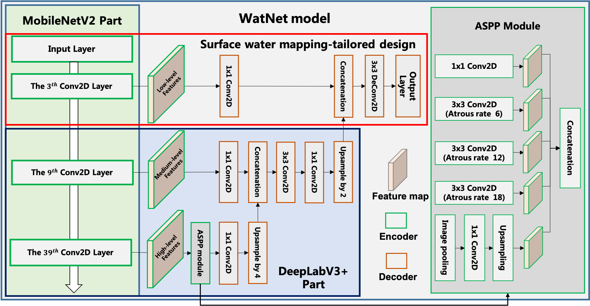

## -- DataSet
- Surface water dataset for Deep learning could be downloaded from Zenodo [**[Link]**](https://doi.org/10.5281/zenodo.5205674).

  
  |Labeling example 1:|Labeling example 2:|
  |:--|:--|
  |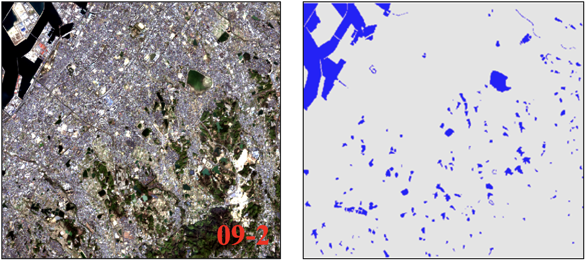||

## -- Performance
- Examples for surface water mapping  

  **Urban region**  
  |Urban scene|AWEI|MNDWI|WatNet|  
  |:--|:--|:--|:--|  
  |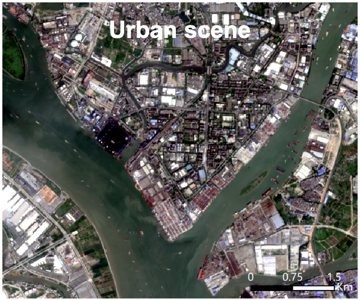|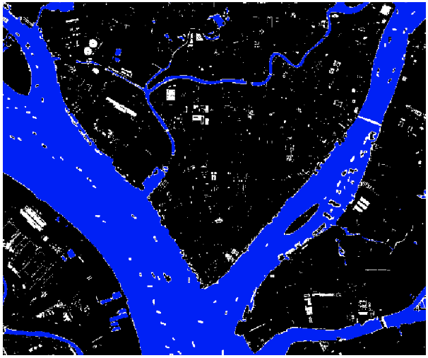|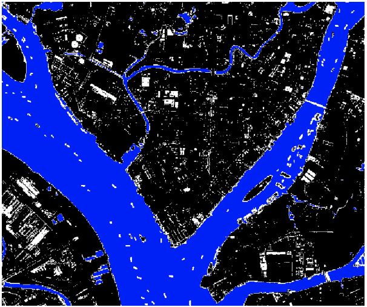|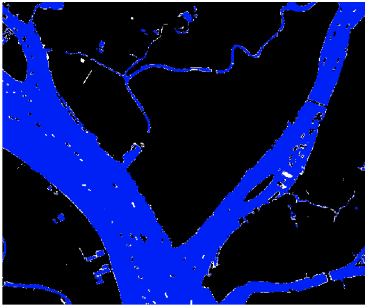|

  **Cloudy region**  
  |Cloudy scene|AWEI|OBIA|WatNet|  
  |:--|:--|:--|:--|  
  |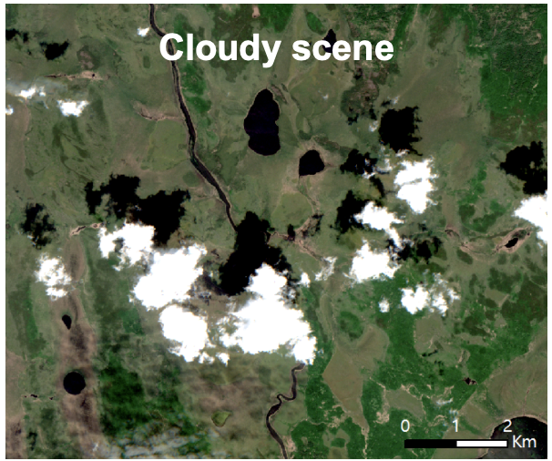|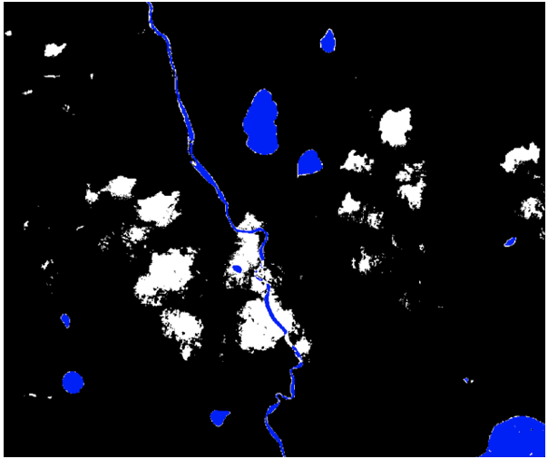|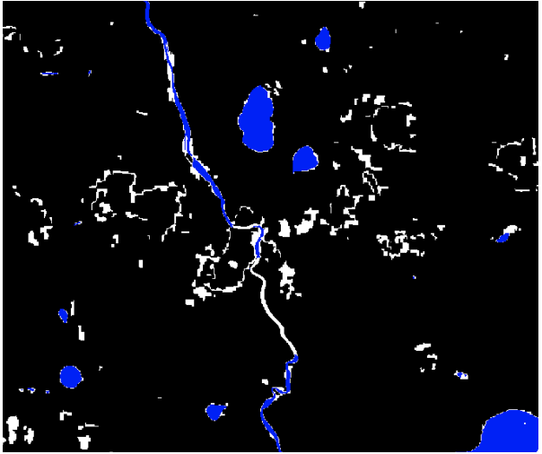|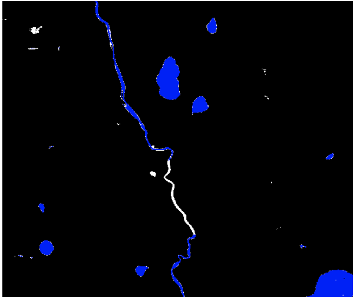|

  **Mountainous region**  
  |Mountain scene|AWEI|OBIA|WatNet|  
  |:--|:--|:--|:--|  
  |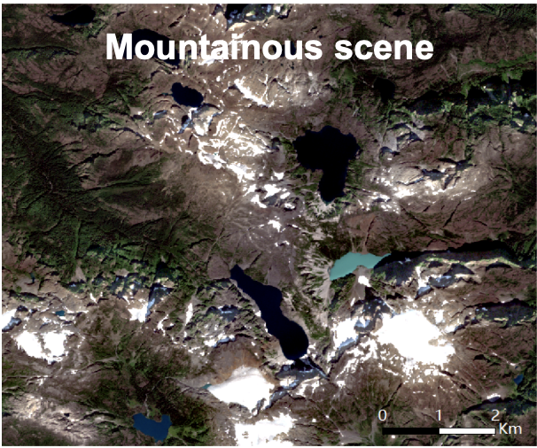|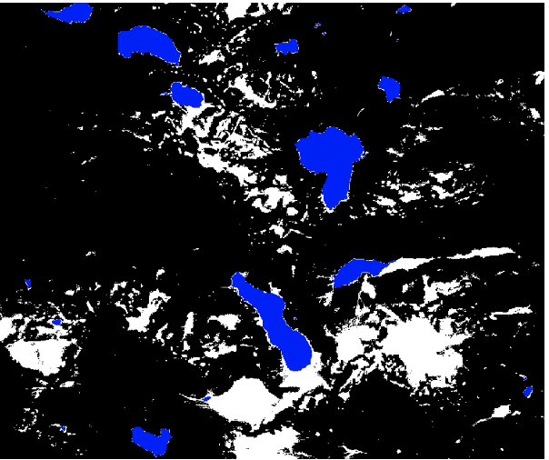|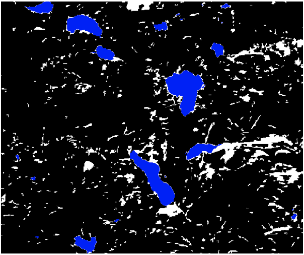|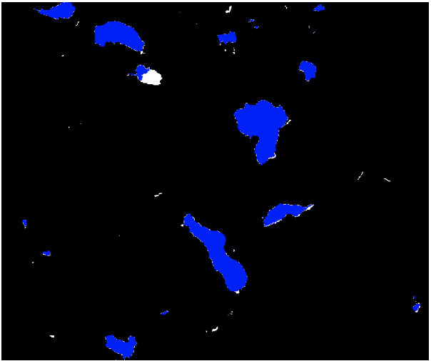|
  

## **-- How to use the trained WatNet?**

### -- Step 1
- Enter the following commands for downloading the code files, and then configure the python and deep learning environment. The deep learning software used in this repo is [Tensorflow 2.5](https://www.tensorflow.org/).

  ~~~console
  git clone https://github.com/xinluo2018/WatNet.git
  ~~~

### -- Step 2
- Download Sentinel-2 images, and select four visible-near infrared 10-m bands and two 20-m shortwave infrared bands, which corresponding to the band number of 2, 3, 4, 8, 11, and 12 of sentinel-2 image.

### -- Step 3
- Add the prepared sentinel-2 image (6 bands) to the **_data/test-demo_** directory, modify the data name in the **_notebooks/infer_demo.ipynb_** file, then running the code file: **_notebooks/infer_demo.ipynb_** and surface water map can be generated. 
- Users also can specify surface water mapping by using the watnet_infer.py, specifically,  
- --- funtional API:
  ~~~python
  from watnet_infer import watnet_infer   
  water_map = watnet_infer(rsimg)  # full example in notebooks/infer_demo.ipynb.
  ~~~
- --- command line API:
  ~~~console
  python watnet_infer.py data/test-demo/*.tif -o data/test-demo/result
  ~~~

## **-- How to train the WatNet?**

- With the Dataset, the user can train the WatNet through running the code file **_train/trainer.ipynb_**. Since [**tfrecords**](https://www.tensorflow.org/tutorials/load_data/tfrecord?hl=zh-tw) format data is required in the model training, the user should convert the .tif format dataset to .tfrecords format dataset by running code file **_dataloader/tfrecord_writter.ipynb_** firstly.


## -- Citation

- Xin Luo, Xiaohua Tong, Zhongwen Hu. An applicable and automatic method for earth surface water mapping based on multispectral images. International Journal of Applied Earth Observation and Geoinformation, 2021, 103, 102472. [[**Link**](https://www.sciencedirect.com/science/article/pii/S0303243421001793)]
  ```
  @article{luo2021_watnet,
  title = {An applicable and automatic method for earth surface water mapping based on multispectral images},
  author = {Xin Luo and Xiaohua Tong and Zhongwen Hu},
  journal = {International Journal of Applied Earth Observation and Geoinformation},
  volume = {103},
  pages = {102472},
  year = {2021}
  }
  ```


## -- Acknowledgement  
- We thanks the authors for providing some of the code in this repo:  
[deeplabv3_plus](https://github.com/luyanger1799/amazing-semantic-segmentation) and [deepwatmapv2](https://github.com/isikdogan/deepwatermap)  

